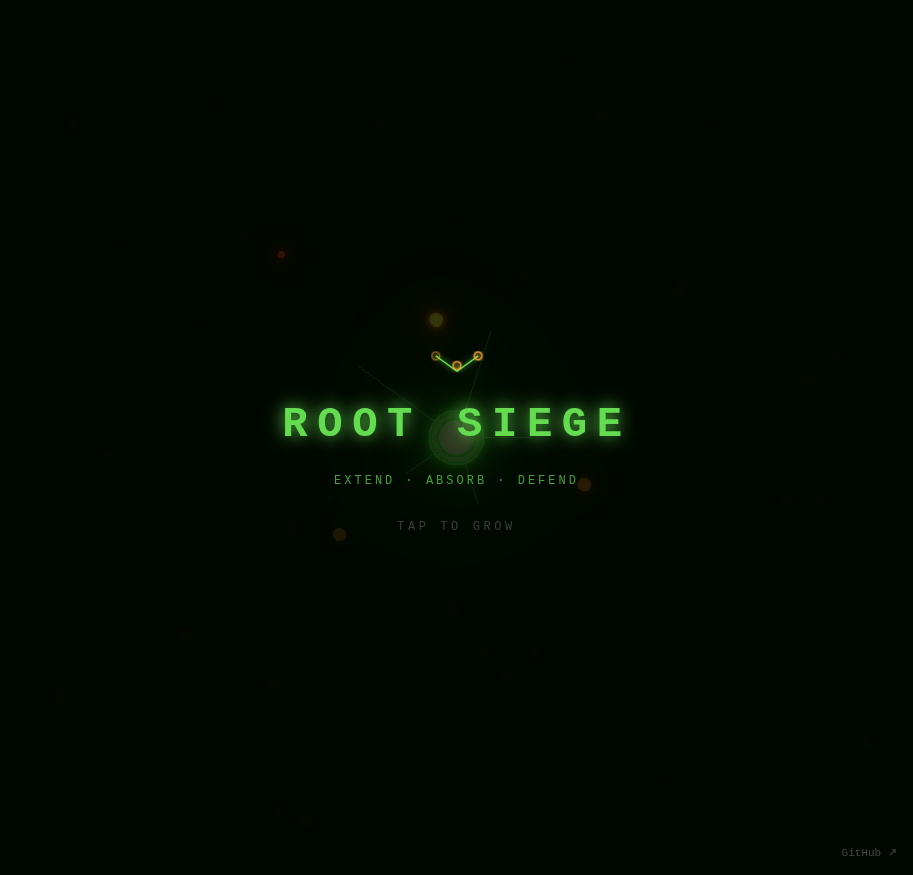

# Root Siege

Extend · Absorb · Defend

A strategic defense game where you grow a root network to connect nodes and absorb incoming beetle swarms before they devour your energy. Tap to grow — but every root costs energy, so plan your network wisely.

## How to Play

- **Tap** to grow roots toward nodes and extend your network
- Connect all nodes to absorb beetles that crawl along your roots
- Beetles damage your energy — run out and it's game over
- Longer roots = more coverage, but higher energy cost to maintain
- Clear all beetles to advance to the next level

## Levels

1. **First Growth** — 6 nodes, gentle beetle spawn
2. **The Infestation** — 8 nodes, more beetles, faster spawn
3. **Deep Roots** — 9 nodes, swarm intensifies
4. **Swarm Season** — 11 nodes, rapid beetle waves
5. **The Last Stand** — 14 nodes, maximum beetle onslaught

## Built With

- [Three.js r183](https://threejs.org/)
- [Tone.js v15.1.22](https://tonejs.github.io/)

## Links

- **Play:** https://nishivector.github.io/root-siege/
- **Repo:** https://github.com/nishivector/root-siege
